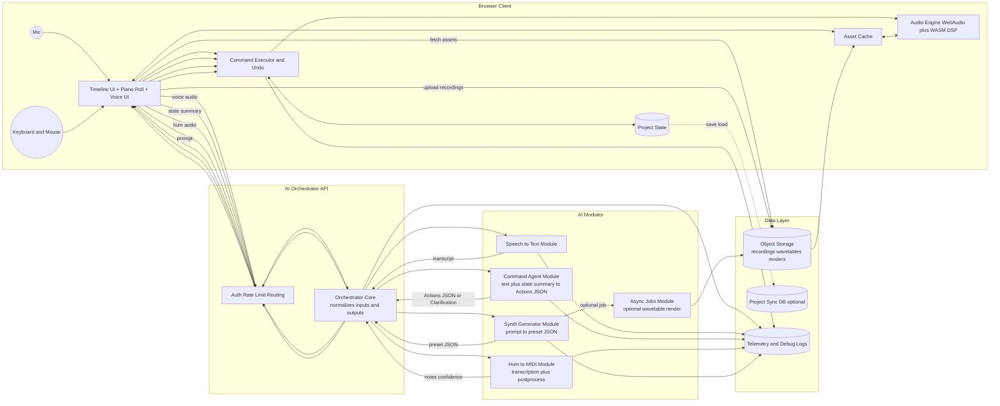

```mermaid
flowchart LR

%% =========================
%% CLIENT (BROWSER)
%% =========================
subgraph C[Browser Client]
  UI[Timeline UI + Piano Roll + Voice UI]
  PS[(Project State)]
  CE[Command Executor and Undo]
  AE[Audio Engine WebAudio plus WASM DSP]
  AM[Asset Cache]
  MIC((Mic))
  KB((Keyboard and Mouse))

  UI --> CE
  CE <--> PS
  CE --> AE
  AM <--> AE
  UI <--> AM
  MIC --> UI
  KB --> UI
end

%% =========================
%% SINGLE BACKEND ENTRYPOINT
%% =========================
subgraph O[AI Orchestrator API]
  GW[Auth Rate Limit Routing]
  OR[Orchestrator Core\nnormalizes inputs and outputs]
  GW --> OR
end

%% =========================
%% INTERNAL MODULES (SWAPPABLE)
%% =========================
subgraph M[AI Modules]
  ASR[Speech to Text Module]
  AG[Command Agent Module\ntext plus state summary to Actions JSON]
  HUM[Hum to MIDI Module\ntranscription plus postprocess]
  SYN[Synth Generator Module\nprompt to preset JSON]
  JOB[Async Jobs Module\noptional wavetable render]
end

%% =========================
%% DATA AND LOGS
%% =========================
subgraph D[Data Layer]
  OBJ[(Object Storage\nrecordings wavetables renders)]
  DB[(Project Sync DB optional)]
  LOG[(Telemetry and Debug Logs)]
end

%% =========================
%% FLOWS
%% =========================

%% Voice commands
UI -->|voice audio| GW
OR --> ASR
ASR -->|transcript| OR
UI -->|state summary| GW
OR --> AG
AG -->|Actions JSON or Clarification| OR
OR --> GW --> UI
UI --> CE

%% Hum to MIDI
UI -->|hum audio| GW
OR --> HUM
HUM -->|notes confidence| OR
OR --> GW --> UI
UI --> CE

%% Generative synth
UI -->|prompt| GW
OR --> SYN
SYN -->|preset JSON| OR
OR --> GW --> UI
UI --> CE

%% Optional async wavetable
SYN -->|optional job| JOB
JOB --> OBJ
UI -->|fetch assets| OBJ --> AM

%% Storage hooks
UI -->|upload recordings| OBJ
CE --> LOG
OR --> LOG
ASR --> LOG
AG --> LOG
HUM --> LOG
SYN --> LOG

%% Optional project sync (later)
PS -.->|save load| DB
```
